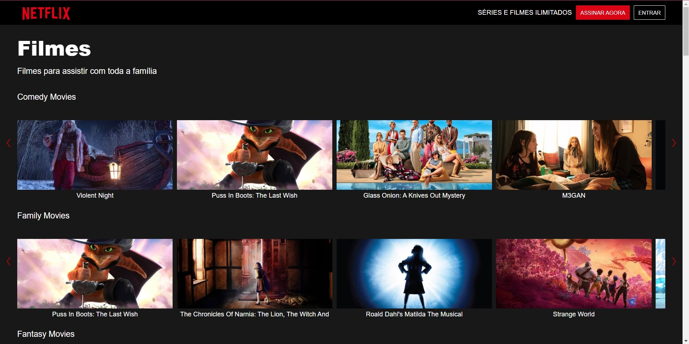

# Digital Innovation One - Netflix Clone

Recreating Netflix interface with HTML, CSS, JavaScript and Node.

## Table of contents

- [Overview](#overview)
  - [Screenshot](#screenshot)
  - [Links](#links)
- [My process](#my-process)
  - [Built with](#built-with)
  - [What I learned](#what-i-learned)

## Overview

### Screenshot

### Links

- Solution URL: [GitHub](https://github.com/amandaquinta/netflix-clone-DIO)
- Live Site URL: [Vercel](https://netflix-clone-dio-jet.vercel.app/)

## My process

### Built with

- HTML
- CSS
- JavaScript
- Node

### What I learned

Solidifying knowledge.
